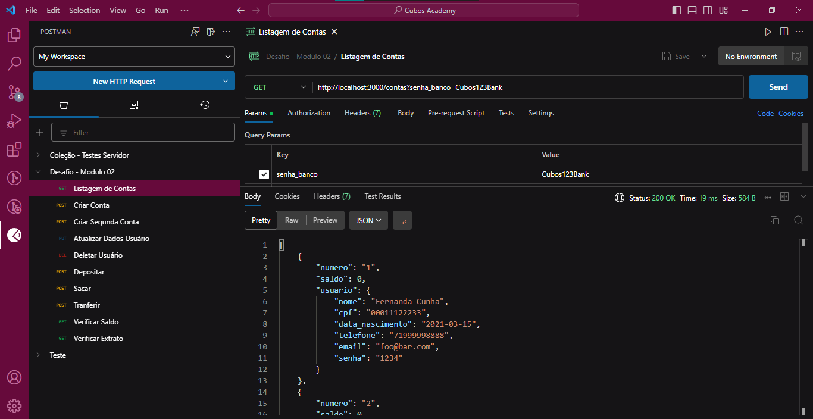

<h4 align="center"> 
	Desafio - Módulo 02 - Back-end
</h4>

<p align="center">
	
</p>

## 💻 Sobre o projeto

📄 A proposta do desafio do módulo 02 do curso de Desenvolvimento de Software com Foco em Back-end da Cubos Academy é criar uma RESTful API para um banco digital chamado Cubos Bank.

---
## ⚙️ Funcionalidades

<ul>
<li>Criar conta bancária;</li>
<li>Listar contas bancárias;</li>
<li>Atualizar os dados do usuário da conta bancária; </li>
<li>Excluir uma conta bancária;</li>
<li>Depósitar em uma conta bancária;</li>
<li>Sacar de uma conta bancária;</li>
<li>Transferir valores entre contas bancárias</li>
<li>Consultar saldo da conta bancária;</li>
<li>Emitir extrato bancário.
</li> </ul>

---

## 🛣️ Como executar o projeto

### Pré-requisitos

Antes de começar, você vai precisar ter instalado em sua máquina as seguintes ferramentas:
[Git](https://git-scm.com), [Node.js](https://nodejs.org/en/). 
Além disto é bom ter um editor para trabalhar com o código como [VSCode](https://code.visualstudio.com/)

#### 🎲 Rodando o Backend (servidor)

```bash

# Clone este repositório
$ git clone git@github.com:JulianaT93/22-desafio-backend-m02-b2bt05.git

# Acesse a pasta do projeto no terminal/cmd
$ cd 22-desafio-backend-m02-b2bt05

# Instale as dependências
$ npm install

# Execute a aplicação em modo de desenvolvimento
$ npm run dev

# O servidor inciará na porta:3000 - acesse http://localhost:3000 

```
---
## 👩‍💻 Exemplo


Exemplo de tela usando o Postman para a listar as contas existentes no banco de dados.



---
## 🛠 Tecnologias

As seguintes ferramentas foram usadas na construção do projeto:


#### [](https://github.com/JulianaT93/22-desafio-backend-m02-b2bt05)**Server**  ([NodeJS](https://nodejs.org/en/))

-   **[Date-fns](https://date-fns.org/)**
-   **[Express](https://expressjs.com/)**
-   **[Nodemon](https://nodemon.io/)**

> Veja o arquivo  [package.json](https://github.com/JulianaT93/22-desafio-backend-m02-b2bt05/blob/main/package.json)

**Utilitários**

-   Editor:  **[Visual Studio Code](https://code.visualstudio.com/)**
-   Teste de API:  **[Postman](https://www.postman.com/)**

> Veja o arquivo  [package.json](https://github.com/JulianaT93/22-desafio-backend-m02-b2bt05/blob/main/teste-api-rotas-postman.json)

---

Feito com ❤️ por Juliana T. 👋🏽 [Entre em contato!](https://www.linkedin.com/in/juliana-toguti/)
